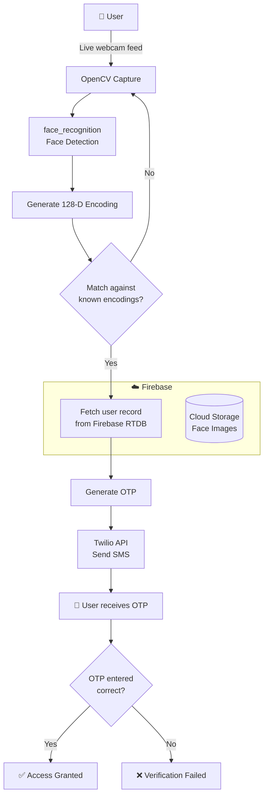
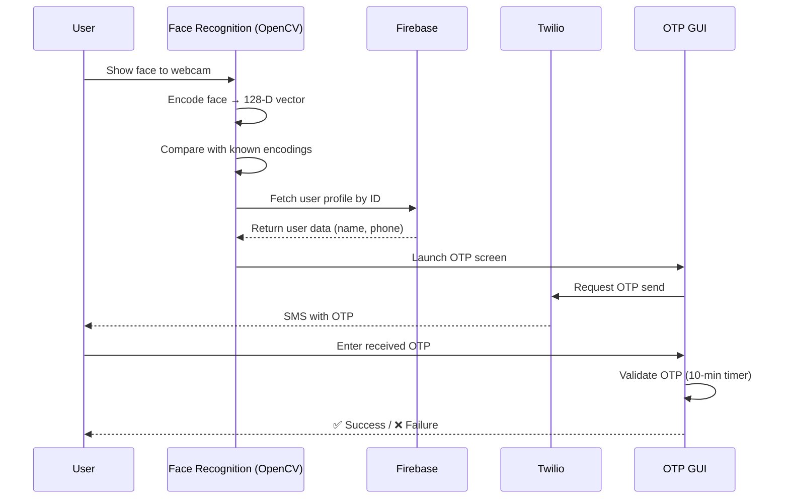

<div align="center">

# 🔐 Face Recognition Login with 2FA

**A biometric authentication system that combines real-time facial recognition with SMS-based One-Time Password (OTP) verification.**

[](https://www.python.org/)
[](https://opencv.org/)
[](https://firebase.google.com/)
[](https://www.twilio.com/)
[](#-license)

</div>

---

## 📖 Overview

This project implements a **multi-factor authentication (MFA)** flow built around computer vision. A user's face is captured through a webcam, encoded into a 128-dimensional feature vector, and matched against a database of known encodings. Once the face is recognized, the system retrieves the user's profile from **Firebase** and triggers a **Twilio SMS OTP** as a second verification factor — adding a strong security layer on top of biometrics.

> **Two factors of identity:** something you *are* (your face) + something you *have* (your phone).

---

## ✨ Features

- 🎥 **Real-time face detection & recognition** from a live webcam feed using `face_recognition` + OpenCV.
- 🧠 **128-D face embeddings** matched via Euclidean distance for accurate identity verification.
- 📱 **SMS-based OTP (2FA)** delivered through the Twilio API, with resend and countdown-timer support.
- ☁️ **Firebase integration** — Realtime Database for user records and Cloud Storage for face images.
- 🔒 **SHA-256 image hashing** for data integrity and tamper detection.
- 🖥️ **Tkinter GUI** for the OTP generation and verification screens.
- ⚡ **Pre-computed encodings** serialized with `pickle` for fast startup.

---

## 🛠️ Tech Stack

| Layer | Technologies |
|-------|--------------|
| **Language** | Python 3.7+ |
| **Computer Vision** | OpenCV, `face_recognition` (dlib), cvzone, NumPy |
| **Backend / Cloud** | Firebase Realtime Database, Firebase Cloud Storage |
| **Messaging** | Twilio (SMS OTP) |
| **GUI** | Tkinter |
| **Security** | SHA-256 hashing (`hashlib`), python-dotenv (env-based secrets) |

---

## 🏗️ System Architecture



---

## 🔄 Authentication Flow



---

## 📂 Project Structure

```
Database_Face_Recognition/
├── main.py                 # Main app: face recognition + OTP flow
├── main_1.py               # Variant: recognition + Firebase image fetch
├── EncodeGenerator.py      # Builds 128-D encodings, uploads images to Firebase
├── AddDataToDatabase.py    # Seeds user records into Firebase RTDB
├── Hashing.py              # SHA-256 hashing of image files
├── program1.py             # OTP generation GUI screen
├── program2.py             # OTP verification GUI screen (timer, resend)
├── OTP_verification.py     # Standalone OTP verifier prototype
├── number.py               # Twilio OTP helper utilities
├── images/                 # Source face images (named by user ID)
├── resources/
│   ├── background.png       # UI background
│   └── Modes/               # Status-mode overlay images
├── EncodeFile.p            # Serialized known encodings (generated)
└── requirements.txt        # Python dependencies
```

---

## 🚀 Getting Started

### Prerequisites
- Python 3.7+
- A webcam
- A [Firebase](https://firebase.google.com/) project (Realtime Database + Storage)
- A [Twilio](https://www.twilio.com/) account (Account SID, Auth Token, phone number)

### 1. Clone the repository
```bash
git clone https://github.com/<your-username>/Database_Face_Recognition.git
cd Database_Face_Recognition
```

### 2. Create a virtual environment
```bash
python -m venv venv
# Windows
venv\Scripts\activate
# macOS / Linux
source venv/bin/activate
```

### 3. Install dependencies
```bash
pip install -r requirements.txt
```
> **Note:** `face_recognition` depends on `dlib`. On Windows you may need CMake and Visual C++ Build Tools installed first.

### 4. Configure credentials
This project loads all secrets from a `.env` file via [`python-dotenv`](https://pypi.org/project/python-dotenv/) — nothing is hardcoded in the source.

- **Firebase:** Download your service-account key from the Firebase console and place it in the project root. Point `FIREBASE_CREDENTIALS` at its filename.
- **Twilio:** Grab your `Account SID`, `Auth Token`, and phone number from the Twilio console.

Copy the provided template and fill in your own values:
```bash
# Windows
copy .env.example .env
# macOS / Linux
cp .env.example .env
```

`.env`:
```env
# Twilio (SMS OTP)
TWILIO_ACCOUNT_SID=your_account_sid
TWILIO_AUTH_TOKEN=your_auth_token
TWILIO_FROM_NUMBER=+1XXXXXXXXXX
TWILIO_TO_NUMBER=+91XXXXXXXXXX

# Firebase
FIREBASE_CREDENTIALS=your-firebase-adminsdk.json
FIREBASE_DB_URL=https://<your-project>-default-rtdb.firebaseio.com/
FIREBASE_STORAGE_BUCKET=<your-project>.appspot.com
```
> Both `.env` and the Firebase service-account JSON are listed in `.gitignore`, so they won't be committed.

### 5. Add users & generate encodings
```bash
python AddDataToDatabase.py    # Seed user records into Firebase
python EncodeGenerator.py      # Build face encodings + upload images
```

### 6. Run the app
```bash
python main.py
```

---

## 🔐 Security Notes

> ⚠️ **Important:** Never commit your Firebase service-account key or Twilio credentials.

- The included `.gitignore` excludes the Firebase admin SDK JSON and `.env` files.
- Load all credentials from **environment variables** or a secrets manager — avoid hardcoding them in source.
- If any keys have been exposed, **rotate them immediately** in the Firebase and Twilio consoles.

---

## 🧭 How It Works (in brief)

1. **Encoding** — `EncodeGenerator.py` reads each image in `images/`, computes a 128-D face encoding with `face_recognition`, uploads the image to Firebase Storage, and serializes all encodings to `EncodeFile.p`.
2. **Recognition** — `main.py` captures webcam frames, detects faces, and compares live encodings against the known set using `compare_faces` / `face_distance`, selecting the closest match.
3. **Lookup** — On a match, the user's record is fetched from Firebase Realtime Database by ID.
4. **2FA** — An OTP is generated and sent via Twilio SMS; the Tkinter GUI validates it against a 10-minute countdown, with a resend option.

---

## 🤝 Contributing

Contributions, issues, and feature requests are welcome. Feel free to open an issue or submit a pull request.

---

## 📄 License

This project is released under the **MIT License**. See [`LICENSE`](LICENSE) for details.

---

<div align="center">
Made with ❤️ and Python
</div>
